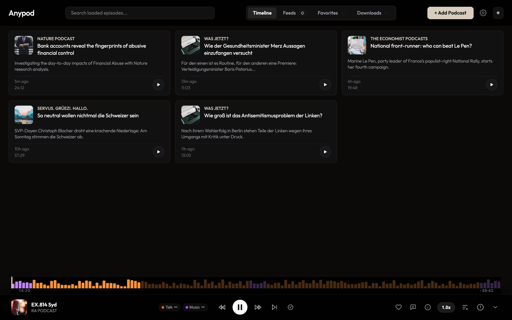
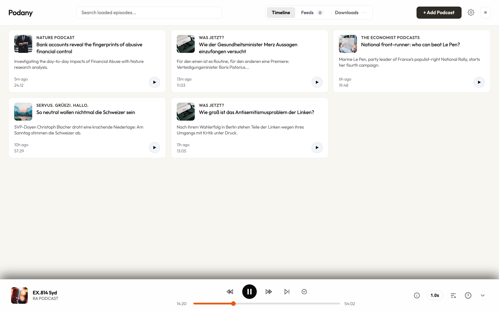
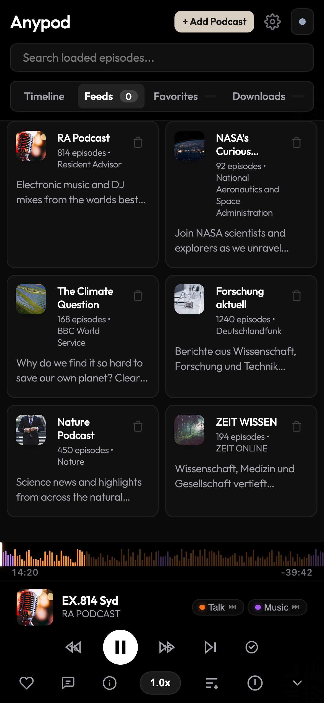
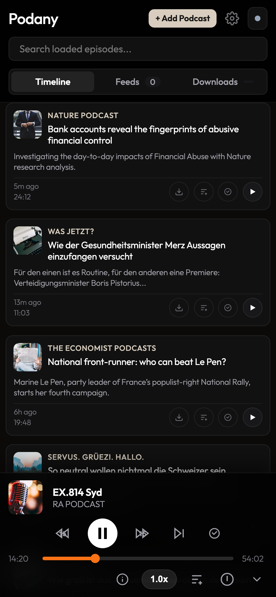

# Podany

Private podcast RSS feed aggregator and web player hosted on Cloudflare Pages with Cloudflare D1 storage.

## Screenshots

<table>
  <tr>
    <td align="center" width="50%"><b>Desktop Dark Mode</b></td>
    <td align="center" width="50%"><b>Desktop Light Mode</b></td>
  </tr>
  <tr>
    <td></td>
    <td></td>
  </tr>
  <tr>
    <td align="center"><b>Mobile Feeds</b></td>
    <td align="center"><b>Mobile Active Playback</b></td>
  </tr>
  <tr>
    <td align="center"></td>
    <td align="center"></td>
  </tr>
</table>

## Features

- **Audio & YouTube Playback**: Streams standard podcast RSS enclosures (MP3, M4A, AAC) and YouTube playlists/channels.
- **Offline Audio Caching (PWA)**: Service worker with Range request support (`HTTP 206`) for offline listening and CacheStorage management.
- **Cross-Device Sync**: Multi-user subscription and playback position synchronization powered by Cloudflare D1 (SQLite at the edge).
- **Passwordless Auth**: Magic link login via Resend with cryptographic token verification.
- **Directory Search**: Search Apple Podcasts directory or paste direct RSS/YouTube URLs.
- **Show Notes & Chapters**: Rich show notes with clickable links and interactive seek timestamps.
- **Playback Controls**: Non-destructive skip (preserves position in Continue Listening), dedicated mark-as-listened button, variable speed (0.8x - 2.0x), and sleep timer.
- **OPML Support**: Export and import subscription lists in standard OPML format.
- **Responsive Interface**: Minimalist dark and light themes, optimized single-column layout on mobile, and desktop multi-column grid.

## Self-Hosting with Docker 🐳

Run Podany completely locally on your home server, NAS (Synology, Unraid, TrueNAS), or Raspberry Pi with local SQLite storage and zero cloud lock-in.

```bash
docker compose up -d
```
See [SELF_HOSTING.md](SELF_HOSTING.md) for detailed configuration, local volumes, offline login, and backup guides.

## Technology Stack

- **Frontend**: Vanilla JavaScript (ES6+), HTML5 Audio, CSS3 Variables, PWA Service Worker.
- **Production Bundler**: `esbuild` minifying modern JS & CSS into `public/dist/`.
- **Hosting Options**: Docker (Self-Hosted on NAS/Server) or Cloudflare Pages.
- **Serverless API**: Cloudflare Pages Functions (`workerd` / local Miniflare runtime).
- **Database**: Local SQLite (in Docker) or Cloudflare D1.
- **Email Delivery**: Resend REST API (optional; offline magic-link mode supported without email provider).

## Project Structure

```
podany/
├── docs/
│   └── screenshots/
│       ├── mobile-feeds.png
│       ├── mobile-player.png
│       ├── preview-dark.png
│       └── preview-light.png
├── functions/
│   └── api/
│       ├── auth/
│       │   ├── logout.js
│       │   ├── send-link.js
│       │   └── verify.js
│       ├── sync/
│       │   ├── feeds.js
│       │   └── position.js
│       ├── audio-proxy.js
│       ├── feed.js
│       └── utils.js
├── public/
│   ├── app.js
│   ├── icon.svg
│   ├── index.html
│   ├── manifest.webmanifest
│   ├── style.css
│   └── sw.js
├── package.json
├── schema.sql
├── wrangler.json
└── README.md
```

## Database Schema

```sql
CREATE TABLE IF NOT EXISTS users (
  id TEXT PRIMARY KEY,
  email TEXT UNIQUE NOT NULL,
  created_at INTEGER DEFAULT (unixepoch())
);

CREATE TABLE IF NOT EXISTS auth_tokens (
  token_hash TEXT PRIMARY KEY,
  user_id TEXT NOT NULL,
  expires_at INTEGER NOT NULL,
  used INTEGER DEFAULT 0,
  created_at INTEGER DEFAULT (unixepoch()),
  FOREIGN KEY (user_id) REFERENCES users(id) ON DELETE CASCADE
);

CREATE TABLE IF NOT EXISTS user_sessions (
  session_hash TEXT PRIMARY KEY,
  user_id TEXT NOT NULL,
  expires_at INTEGER NOT NULL,
  created_at INTEGER DEFAULT (unixepoch()),
  FOREIGN KEY (user_id) REFERENCES users(id) ON DELETE CASCADE
);

CREATE TABLE IF NOT EXISTS subscriptions (
  id TEXT PRIMARY KEY,
  user_id TEXT NOT NULL,
  feed_url TEXT NOT NULL,
  title TEXT,
  artwork TEXT,
  created_at INTEGER DEFAULT (unixepoch()),
  UNIQUE(user_id, feed_url),
  FOREIGN KEY (user_id) REFERENCES users(id) ON DELETE CASCADE
);

CREATE TABLE IF NOT EXISTS playback_state (
  id TEXT PRIMARY KEY,
  user_id TEXT NOT NULL,
  episode_guid TEXT NOT NULL,
  position_seconds REAL DEFAULT 0,
  completed INTEGER DEFAULT 0,
  last_listened_at INTEGER DEFAULT (unixepoch()),
  UNIQUE(user_id, episode_guid),
  FOREIGN KEY (user_id) REFERENCES users(id) ON DELETE CASCADE
);
```

## Local Development

### Prerequisites

- Node.js 18 or higher
- npm 9 or higher
- Cloudflare Wrangler CLI

### Setup

1. Install dependencies:
   ```bash
   npm install
   ```

2. (Optional) Initialize local SQLite database:
   ```bash
   npm run dev:init-db
   ```

3. Start local development server:
   ```bash
   npm run dev
   ```
   Open `http://localhost:8788` in your browser.

## Deployment

### 1. Create D1 Database

```bash
npx wrangler d1 create podany-db
```

Update `database_id` in `wrangler.json` with the generated database ID.

Execute the schema against the remote D1 instance:
```bash
npx wrangler d1 execute podany-db --file=schema.sql --remote
```

### 2. Configure Secrets and Variables

Set the Resend API key for authentication emails:
```bash
npx wrangler pages secret put RESEND_API_KEY --project-name podany
```

Verify or update the variables in `wrangler.json`:
```json
{
  "vars": {
    "APP_URL": "https://podany.poizoom.com",
    "FROM_EMAIL": "Podany <login@podany.poizoom.com>"
  }
}
```

### 3. Deploy to Cloudflare Pages

```bash
npx wrangler pages deploy public --project-name podany --branch main
```

## Configuration

| Name | Type | Target | Description |
| :--- | :--- | :--- | :--- |
| `DB` | D1 Binding | `wrangler.json` | Cloudflare D1 database binding (`podany-db`) |
| `RESEND_API_KEY` | Secret | Pages Secrets | Resend API key for transactional login emails |
| `APP_URL` | String | `wrangler.json` | Canonical base URL used in magic links |
| `FROM_EMAIL` | String | `wrangler.json` | Sender address for magic link emails |

## License

MIT License. Copyright (c) 2026 Steffen Klaue.
