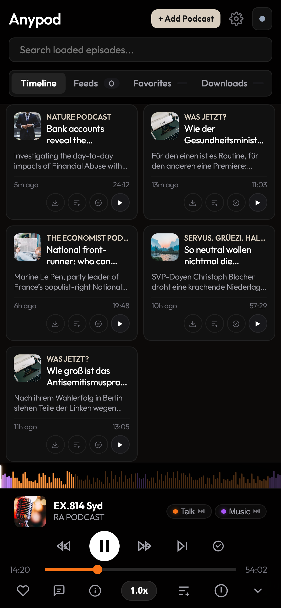
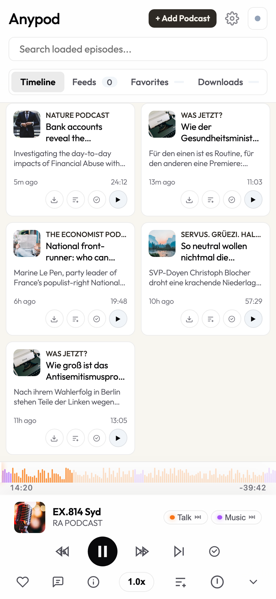
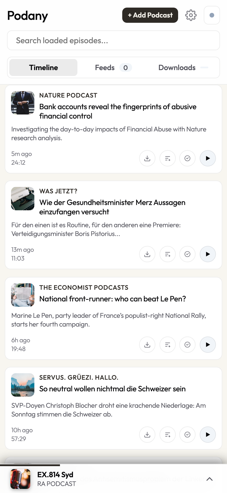
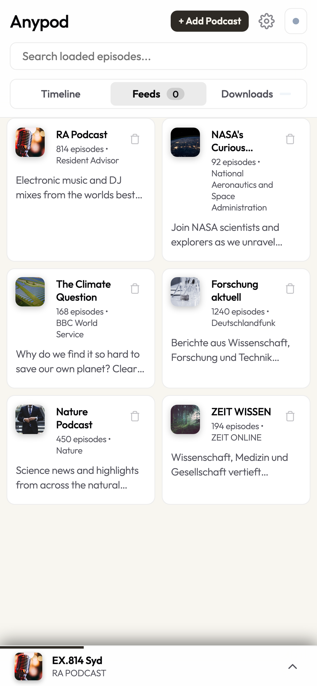

# Anypod

[](https://anypod.org)
[](LICENSE)
[](https://github.com/orangedot/anypod)

> 🌐 **Live App:** [**anypod.org**](https://anypod.org) — no account needed to start listening.

**Your podcasts. No algorithm. No ads. No account required.**

Anypod is a free, open-source podcast player that respects you. Open it, search any podcast, and start listening — no sign-up wall, no tracking, no data sold. Cloud sync is *optional* and the data you give us has an expiry date.

## Why Anypod?

| | Anypod | Spotify | Apple Podcasts | Pocket Casts |
|---|:---:|:---:|:---:|:---:|
| No account required | ✅ | ❌ | ❌ | ❌ |
| No ads | ✅ | ❌ | ✅ | ✅ |
| Open source | ✅ | ❌ | ❌ | ❌ |
| Self-hostable | ✅ | ❌ | ❌ | ❌ |
| Auto-deletes inactive accounts | ✅ | ❌ | ❌ | ❌ |
| Offline playback (PWA) | ✅ | ✅ (app) | ✅ (app) | ✅ (app) |
| YouTube feeds | ✅ | ❌ | ❌ | ❌ |

## Privacy, by Design

- **Email only** — the only personal data we ever store is your email (for optional sync login)
- **No tracking, no analytics SDKs, no ads** — the codebase has zero third-party scripts
- **Account auto-deletion** — if you don't log in for 50 days, your account is deleted automatically. We send two warning emails beforehand, each with a one-click link to export your data. We don't hoard.
- **Data portability** — export your subscriptions as OPML any time, import them anywhere
- **Self-host it** — run your own instance in ~10 minutes on Cloudflare's free tier, or locally with Docker

## Screenshots

### Desktop Views

<table>
  <tr>
    <th align="center" width="50%">Dark Theme</th>
    <th align="center" width="50%">Light Theme</th>
  </tr>
  <tr>
    <td align="center"><b>Desktop (Timeline & Full Player)</b></td>
    <td align="center"><b>Desktop (Timeline & Full Player)</b></td>
  </tr>
  <tr>
    <td></td>
    <td></td>
  </tr>
</table>

### Mobile Views

<table>
  <tr>
    <th align="center" width="33.3%">Full Player</th>
    <th align="center" width="33.3%">Mini-Player & Timeline</th>
    <th align="center" width="33.3%">Subscribed Feeds</th>
  </tr>
  <tr>
    <td align="center"></td>
    <td align="center"></td>
    <td align="center"></td>
  </tr>
  <tr>
    <td align="center"><b>Active Playback (Dark)</b></td>
    <td align="center"><b>Mini-Player (Dark)</b></td>
    <td align="center"><b>Subscribed Feeds (Dark)</b></td>
  </tr>
  <tr>
    <td align="center"></td>
    <td align="center"></td>
    <td align="center"></td>
  </tr>
  <tr>
    <td align="center"><b>Active Playback (Light)</b></td>
    <td align="center"><b>Mini-Player (Light)</b></td>
    <td align="center"><b>Subscribed Feeds (Light)</b></td>
  </tr>
</table>

## Features

- **Audio & YouTube Playback**: Streams standard podcast RSS enclosures (MP3, M4A, AAC) and YouTube playlists/channels.
- **Offline Audio Caching (PWA)**: Service worker with Range request support (`HTTP 206`) for offline listening and CacheStorage management.
- **Cross-Device Sync**: Multi-user subscription and playback position synchronization powered by Cloudflare D1 (SQLite at the edge).
- **Passwordless Auth**: Magic link login via Resend with cryptographic token verification.
- **Directory Search**: Search Apple Podcasts directory or paste direct RSS/YouTube URLs.
- **Show Notes & Chapters**: Rich show notes with clickable links and interactive seek timestamps.
- **Playback Controls**: Non-destructive skip (preserves position in Continue Listening), dedicated mark-as-listened button, variable speed (0.8x - 2.0x), and sleep timer.
- **OPML Support**: Export and import subscription lists in standard OPML format.
- **Responsive Interface**: Minimalist dark and light themes, optimized single-column layout on mobile, and desktop multi-column grid.

## Technology Stack

- **Frontend**: Vanilla JavaScript (ES6+), HTML5 Audio, CSS3 Variables, PWA Service Worker.
- **Hosting**: Cloudflare Pages.
- **Serverless API**: Cloudflare Pages Functions (`workerd`).
- **Database**: Cloudflare D1 (SQLite).
- **Email Delivery**: Resend REST API.

## Project Structure

```
anypod/
├── docs/
│   └── screenshots/
│       ├── preview-dark.png
│       └── preview-light.png
├── functions/
│   └── api/
│       ├── auth/
│       │   ├── logout.js
│       │   ├── send-link.js
│       │   └── verify.js
│       ├── sync/
│       │   ├── feeds.js
│       │   └── position.js
│       ├── audio-proxy.js
│       ├── feed.js
│       └── utils.js
├── public/
│   ├── app.js
│   ├── icon.svg
│   ├── index.html
│   ├── manifest.webmanifest
│   ├── style.css
│   └── sw.js
├── package.json
├── schema.sql
├── wrangler.json
└── README.md
```

## Database Schema

```sql
CREATE TABLE IF NOT EXISTS users (
  id TEXT PRIMARY KEY,
  email TEXT UNIQUE NOT NULL,
  created_at INTEGER DEFAULT (unixepoch())
);

CREATE TABLE IF NOT EXISTS auth_tokens (
  token_hash TEXT PRIMARY KEY,
  user_id TEXT NOT NULL,
  expires_at INTEGER NOT NULL,
  used INTEGER DEFAULT 0,
  created_at INTEGER DEFAULT (unixepoch()),
  FOREIGN KEY (user_id) REFERENCES users(id) ON DELETE CASCADE
);

CREATE TABLE IF NOT EXISTS user_sessions (
  session_hash TEXT PRIMARY KEY,
  user_id TEXT NOT NULL,
  expires_at INTEGER NOT NULL,
  created_at INTEGER DEFAULT (unixepoch()),
  FOREIGN KEY (user_id) REFERENCES users(id) ON DELETE CASCADE
);

CREATE TABLE IF NOT EXISTS subscriptions (
  id TEXT PRIMARY KEY,
  user_id TEXT NOT NULL,
  feed_url TEXT NOT NULL,
  title TEXT,
  artwork TEXT,
  created_at INTEGER DEFAULT (unixepoch()),
  UNIQUE(user_id, feed_url),
  FOREIGN KEY (user_id) REFERENCES users(id) ON DELETE CASCADE
);

CREATE TABLE IF NOT EXISTS playback_state (
  id TEXT PRIMARY KEY,
  user_id TEXT NOT NULL,
  episode_guid TEXT NOT NULL,
  position_seconds REAL DEFAULT 0,
  completed INTEGER DEFAULT 0,
  last_listened_at INTEGER DEFAULT (unixepoch()),
  UNIQUE(user_id, episode_guid),
  FOREIGN KEY (user_id) REFERENCES users(id) ON DELETE CASCADE
);
```

## Local Development

### Prerequisites

- Node.js 18 or higher
- npm 9 or higher
- Cloudflare Wrangler CLI

### Setup

1. Install dependencies:
   ```bash
   npm install
   ```

2. (Optional) Initialize local SQLite database:
   ```bash
   npm run dev:init-db
   ```

3. Start local development server:
   ```bash
   npm run dev
   ```
   Open `http://localhost:8788` in your browser.

## Deployment

### 1. Create D1 Database

```bash
npx wrangler d1 create anypod-db
```

Update `database_id` in `wrangler.json` with the generated database ID.

Execute the schema against the remote D1 instance:
```bash
npx wrangler d1 execute anypod-db --file=schema.sql --remote
```

### 2. Configure Secrets and Variables

Set the Resend API key for authentication emails:
```bash
npx wrangler pages secret put RESEND_API_KEY --project-name anypod
```

Verify or update the variables in `wrangler.json`:
```json
{
  "vars": {
    "APP_URL": "https://anypod.org",
    "FROM_EMAIL": "Anypod <login@anypod.org>"
  }
}
```

### 3. Deploy to Cloudflare Pages

```bash
npx wrangler pages deploy public --project-name anypod --branch main
```

## Configuration

| Name | Type | Target | Description |
| :--- | :--- | :--- | :--- |
| `DB` | D1 Binding | `wrangler.json` | Cloudflare D1 database binding (`anypod-db`) |
| `RESEND_API_KEY` | Secret | Pages Secrets | Resend API key for transactional login emails |
| `APP_URL` | String | `wrangler.json` | Canonical base URL used in magic links |
| `FROM_EMAIL` | String | `wrangler.json` | Sender address for magic link emails |

## Support the Project

Anypod is free, open-source, and built by one person in their spare time.

If it saves you from another tracking-heavy podcast app, consider:

- ⭐ **[Star the repo](https://github.com/orangedot/anypod)** — helps others find it
- 💬 **[Open a Discussion](https://github.com/orangedot/anypod/discussions)** — share your setup, request features, report bugs
- 🛠️ **Contribute** — PRs welcome, especially self-hosting improvements and new language support

## License

MIT License. Copyright (c) 2026 Steffen Klaue.
