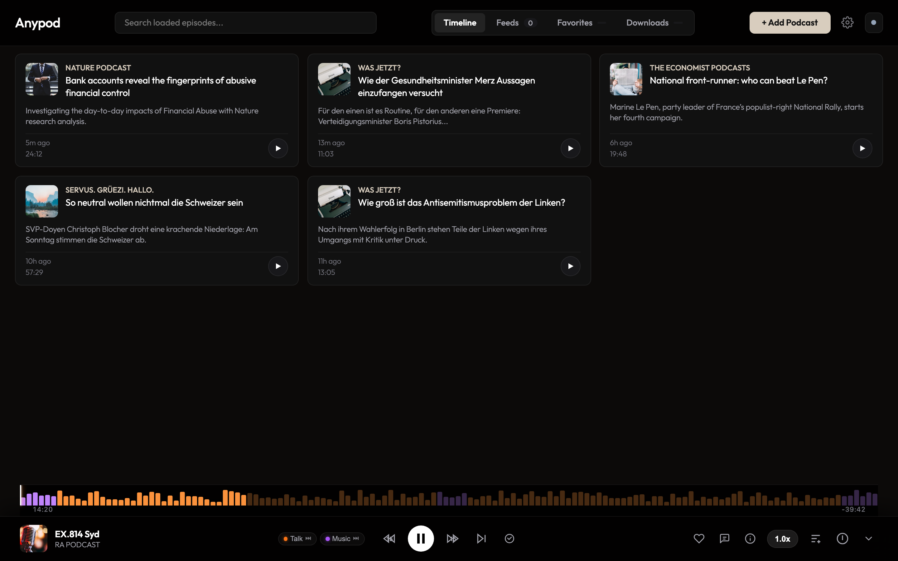
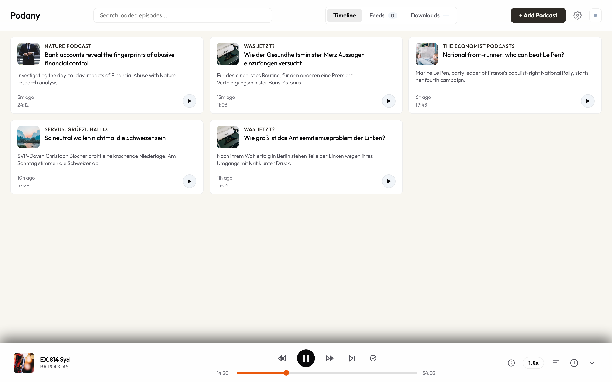
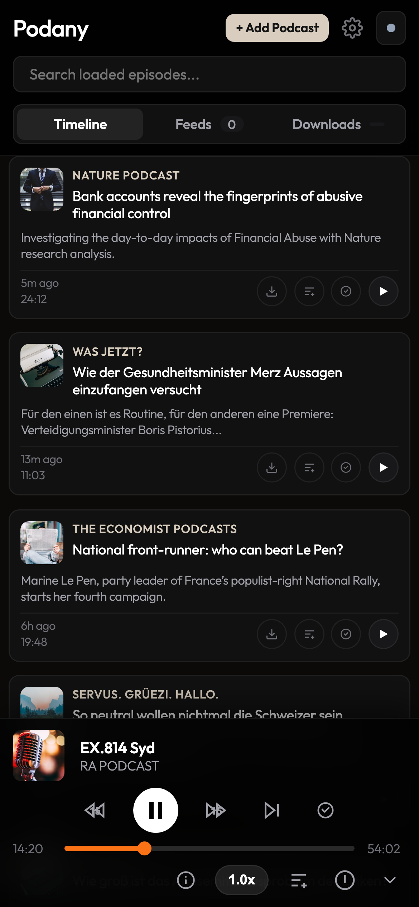
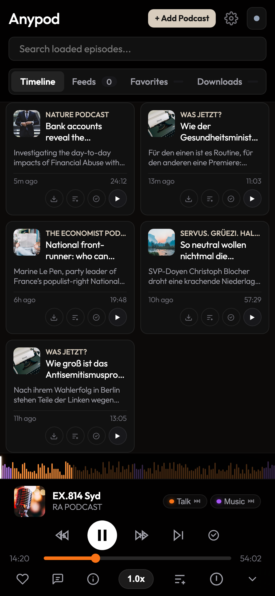
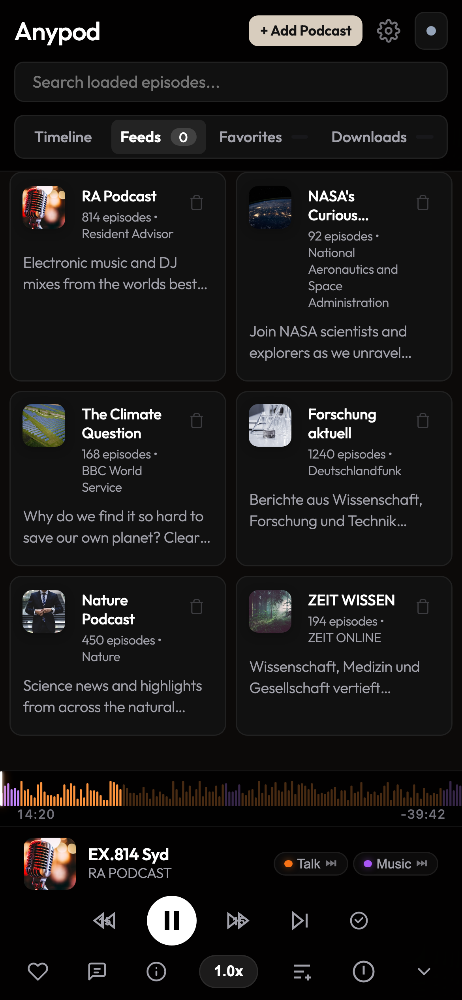
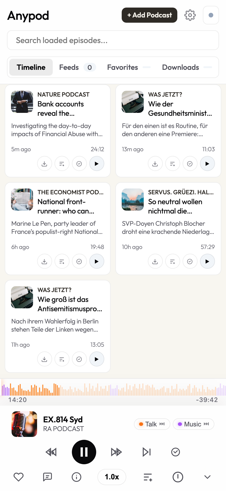
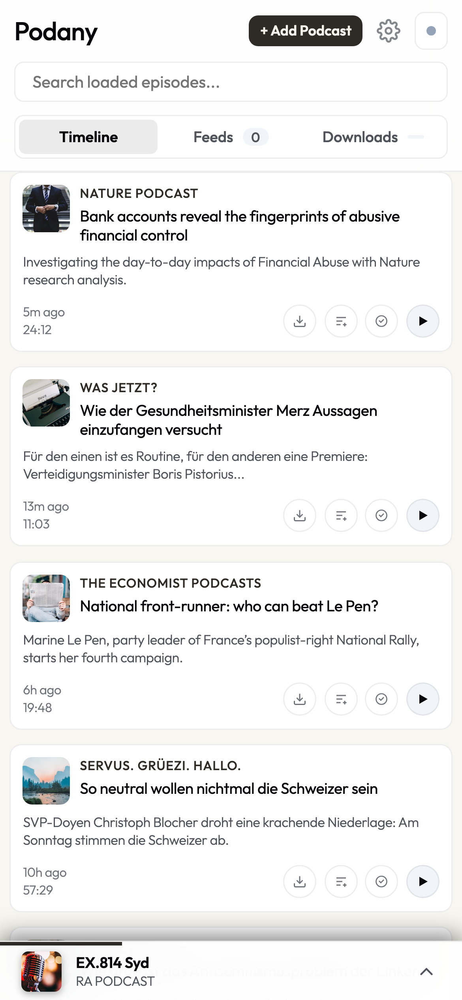
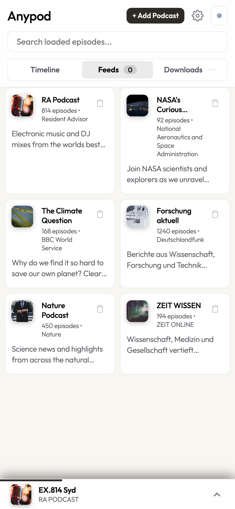

# Anypod

[](https://anypod.org)
[](https://dj.anypod.org)
[](https://sets.anypod.org)
[](LICENSE)
[](https://github.com/orangedot/anypod)

> 🌐 **Live App:** [**anypod.org**](https://anypod.org) — no account needed to start listening.  
> 🎧 **DJ Studio:** [**dj.anypod.org**](https://dj.anypod.org) — dual-deck Web Audio DJ mixing console.  
> ⏱️ **Workout Sets:** [**sets.anypod.org**](https://sets.anypod.org) — interval training sequencer with audio crossfading.

**Your podcasts. No algorithm. No ads. No account required.**

Anypod is a free, open-source podcast player that respects you. Open it, search any podcast, and start listening — no sign-up wall, no tracking, no data sold. Cloud sync is *optional* and the data you give us has an expiry date.

## Why Anypod?

| | Anypod | Spotify | Apple Podcasts | Pocket Casts |
|---|:---:|:---:|:---:|:---:|
| No account required | ✅ | ❌ | ❌ | ❌ |
| No ads | ✅ | ❌ | ✅ | ✅ |
| Open source | ✅ | ❌ | ❌ | ❌ |
| Self-hostable | ✅ | ❌ | ❌ | ❌ |
| Auto-deletes inactive accounts | ✅ | ❌ | ❌ | ❌ |
| Offline playback (PWA) | ✅ | ✅ (app) | ✅ (app) | ✅ (app) |
| YouTube feeds & playlists | ✅ | ❌ | ❌ | ❌ |
| Synchronized song lyrics (LRCLIB) | ✅ | ✅ | ❌ | ❌ |
| Dual-deck DJ mixing mode | ✅ | ❌ | ❌ | ❌ |
| HIIT / workout interval sequencer | ✅ | ❌ | ❌ | ❌ |

## Privacy, by Design

- **Email only** — the only personal data we ever store is your email (for optional sync login)
- **No tracking, no analytics SDKs, no ads** — the codebase has zero third-party scripts
- **Account auto-deletion** — if you don't log in for 50 days, your account is deleted automatically. We send two warning emails beforehand, each with a one-click link to export your data. We don't hoard.
- **Data portability** — export your subscriptions as OPML any time, import them anywhere
- **Self-host it** — run your own instance in ~10 minutes on Cloudflare's free tier, or locally with Docker

## Screenshots

### Desktop Views

<table>
  <tr>
    <th align="center" width="50%">Dark Theme</th>
    <th align="center" width="50%">Light Theme</th>
  </tr>
  <tr>
    <td align="center"><b>Desktop (Timeline & Full Player)</b></td>
    <td align="center"><b>Desktop (Timeline & Full Player)</b></td>
  </tr>
  <tr>
    <td></td>
    <td></td>
  </tr>
</table>

### Mobile Views

<table>
  <tr>
    <th align="center" width="33.3%">Full Player</th>
    <th align="center" width="33.3%">Mini-Player & Timeline</th>
    <th align="center" width="33.3%">Subscribed Feeds</th>
  </tr>
  <tr>
    <td align="center"></td>
    <td align="center"></td>
    <td align="center"></td>
  </tr>
  <tr>
    <td align="center"><b>Active Playback (Dark)</b></td>
    <td align="center"><b>Mini-Player (Dark)</b></td>
    <td align="center"><b>Subscribed Feeds (Dark)</b></td>
  </tr>
  <tr>
    <td align="center"></td>
    <td align="center"></td>
    <td align="center"></td>
  </tr>
  <tr>
    <td align="center"><b>Active Playback (Light)</b></td>
    <td align="center"><b>Mini-Player (Light)</b></td>
    <td align="center"><b>Subscribed Feeds (Light)</b></td>
  </tr>
</table>

## Core Features

### 🎧 Audio & Podcast Playback
- **Podcast RSS Enclosures**: High-fidelity streaming of MP3, M4A, AAC with Range request support (`HTTP 206`).
- **YouTube Playlists & Channels**: Direct YouTube playback without API keys; retains original video creators and playlist titles.
- **Continuous Background Playback**: Android and iOS lockscreen support via MediaSession with multi-density artwork (96px up to 512px).
- **Zero-Stall Network Recovery**: Automatic reconnect watchdog and immediate fallback to `/api/audio-proxy` on CDN/demux errors (Code 4) without blocking in background tabs.
- **Offline Audio Caching (PWA)**: Service worker with CacheStorage management and byte-range streaming for offline listening.

### 📜 Lyrics, Chapters & Show Notes
- **Synchronized Lyrics (LRCLIB)**: Line-by-line synchronized lyrics in player and show notes with smooth auto-scroll, current line highlighting, and tap-to-seek.
- **Podcasting 2.0 Chapters**: Native support for `<podcast:chapters>` (JSON specification) with chapter titles, images, and external URLs.
- **Interactive Timestamps**: Clickable show note timestamps for direct chapter and topic jumping.
- **Deep Search**: Fast search across podcast titles, episode descriptions, show notes, and transcripts.

### 🎛️ Playlist & Feed Management
- **Smart Sorting & Filtering**: Sort by newest, oldest, longest, shortest, or alphabetical. Filter by unplayed, played, or downloaded.
- **Played Episodes to End**: Automatically groups finished episodes at the bottom of the feed by default.
- **Queue & Shuffle**: On-the-fly queueing, "Play All", shuffle playback, and non-destructive skip (keeps your place in Continue Listening).
- **OPML Import/Export**: Easy 1-click import and export of your subscription library.

### 🌐 Cross-Device Sync & Auth
- **Passwordless Magic Links**: Instant login via Resend with cryptographic session hashing.
- **Edge SQLite (Cloudflare D1)**: Synchronizes subscribed feeds and playback positions across mobile and desktop.
- **Cross-Subdomain Session Sharing**: Single login session automatically shared between `anypod.org` and `dj.anypod.org`.

---

## 🎚️ Companion Apps & Specialized Modes

### 1. DJ Studio (`dj.anypod.org` / `/dj`)
- **Dual-Deck Web Audio Engine**: Separate Deck A & Deck B players with equal-power crossfader.
- **BPM & Pitch Controls**: Variable playback rate (0.5x to 2.0x), beat pitch bending, and tap tempo.
- **Hot Cues & Loops**: Instant cue triggers (Cue 1–4) and precision audio looping (1, 2, 4, 8, 16 beats).
- **3-Band EQ & Filters**: Real-time Low, Mid, and High shelf filters with kill switches.
- **DJ Crate & Feed Picker**: Browse your subscribed podcasts, search individual episodes, or import external audio streams directly into either deck.

### 2. Workout Interval DJ Sequencer (`sets.anypod.org` / `/sets.html`)
- **OLED High-Contrast UI**: Electric Red (Work), Neon Cyan (Rest), Amber (Warmup), and Emerald (Cooldown).
- **Gym-Grade Oversized Controls**: Massive 88px buttons and 96px countdown timers readable from across the room.
- **Audio Crossfader & Pre-Buffering**: Seamlessly crossfades interval music blocks 5s before transitions.
- **Synthesized Countdown Cues**: Low-latency 440 Hz warning beeps (3s, 2s, 1s) and 880 Hz interval tones with automatic music ducking (to 30%).
- **WakeLock & Cross-App Sync**: Keeps screen awake during workouts and automatically pauses the main Anypod player via `BroadcastChannel`.

### 3. Audio Testbed (`/audio.html`)
- Standalone diagnostic testbed for mobile browser background streaming, wake lock behavior, and lockscreen telemetry inspection.

---

## Guides & Documentation

- 🎧 **[DJ Studio Console Guide & Feature Roadmap](docs/DJ_STUDIO_ROADMAP.md)** — Control-by-control implementation audit, active vs. planned features, and multi-device audio routing (Bluetooth PFL cueing + USB-C/Jack main out).
- 🎵 **[YouTube Music & Playlist Export Guide](docs/YOUTUBE_MUSIC_EXPORT.md)** — Export your private Liked Music library or YouTube playlists into Anypod using a 1-click console script or range selector.
- ⏱️ **[Workout Sets & Interval DJ Guide](docs/SETS.md)** — Architecture, dual-deck crossfade curves, and configuration for the interval sequencer.
- 🚀 **[Self-Hosting Guide](SELF_HOSTING.md)** — Run your own Anypod instance on Cloudflare Pages or Docker.

---

## Technology Stack

- **Frontend**: Vanilla JavaScript (ES6+), HTML5 Audio, Web Audio API, CSS3 Variables, PWA Service Worker.
- **Hosting**: Cloudflare Pages.
- **Serverless API**: Cloudflare Pages Functions (`workerd`).
- **Database**: Cloudflare D1 (SQLite at the edge).
- **Email Delivery**: Resend REST API.
- **Lyrics Provider**: [LRCLIB](https://lrclib.net/) API.

---

## Project Structure

```
anypod/
├── docs/
│   ├── screenshots/              # Application preview screenshots
│   ├── SETS.md                   # Workout Interval DJ Sequencer docs
│   └── YOUTUBE_MUSIC_EXPORT.md   # YouTube Music export documentation
├── functions/
│   ├── _middleware.js            # Subdomain routing (dj.*, sets.*, canonical 301)
│   └── api/
│       ├── auth/                 # Passwordless login, session verification, logout
│       ├── sync/                 # D1 cross-device subscription and position sync
│       ├── audio-proxy.js        # Edge streaming proxy for CORS & restrictive CDNs
│       ├── feed.js               # RSS, iTunes search & YouTube feed parser
│       └── utils.js
├── public/
│   ├── app.js                    # Core Anypod player application
│   ├── dj.html                   # DJ Studio application
│   ├── sets.html                 # Workout Interval Sequencer application
│   ├── audio.html                # Audio engine testbed
│   ├── style.css                 # Responsive stylesheet (dark/light themes)
│   ├── sw.js                     # PWA Service Worker with HTTP 206 caching
│   └── dist/                     # Production minified bundle
├── scripts/
│   ├── build.js                  # Production bundler & asset optimizer
│   ├── check_audio_sources.js    # Audio stream & HTTP 206 byte-range auditor
│   ├── check_curated_feeds.js    # Curated podcast feed validator
│   └── verify-deploy.js          # Deployment pre-flight checks
├── package.json
├── schema.sql                    # Cloudflare D1 SQLite database schema
├── wrangler.json                 # Cloudflare Pages & D1 bindings
└── README.md
```

---

## Database Schema

```sql
CREATE TABLE IF NOT EXISTS users (
  id TEXT PRIMARY KEY,
  email TEXT UNIQUE NOT NULL,
  created_at INTEGER DEFAULT (unixepoch())
);

CREATE TABLE IF NOT EXISTS auth_tokens (
  token_hash TEXT PRIMARY KEY,
  user_id TEXT NOT NULL,
  expires_at INTEGER NOT NULL,
  used INTEGER DEFAULT 0,
  created_at INTEGER DEFAULT (unixepoch()),
  FOREIGN KEY (user_id) REFERENCES users(id) ON DELETE CASCADE
);

CREATE TABLE IF NOT EXISTS user_sessions (
  session_hash TEXT PRIMARY KEY,
  user_id TEXT NOT NULL,
  expires_at INTEGER NOT NULL,
  created_at INTEGER DEFAULT (unixepoch()),
  FOREIGN KEY (user_id) REFERENCES users(id) ON DELETE CASCADE
);

CREATE TABLE IF NOT EXISTS subscriptions (
  id TEXT PRIMARY KEY,
  user_id TEXT NOT NULL,
  feed_url TEXT NOT NULL,
  title TEXT,
  artwork TEXT,
  created_at INTEGER DEFAULT (unixepoch()),
  UNIQUE(user_id, feed_url),
  FOREIGN KEY (user_id) REFERENCES users(id) ON DELETE CASCADE
);

CREATE TABLE IF NOT EXISTS playback_state (
  id TEXT PRIMARY KEY,
  user_id TEXT NOT NULL,
  episode_guid TEXT NOT NULL,
  position_seconds REAL DEFAULT 0,
  completed INTEGER DEFAULT 0,
  last_listened_at INTEGER DEFAULT (unixepoch()),
  UNIQUE(user_id, episode_guid),
  FOREIGN KEY (user_id) REFERENCES users(id) ON DELETE CASCADE
);
```

---

## Local Development

### Prerequisites

- Node.js 18 or higher
- npm 9 or higher
- Cloudflare Wrangler CLI

### Setup

1. **Install dependencies:**
   ```bash
   npm install
   ```

2. **Initialize local SQLite database (optional):**
   ```bash
   npm run dev:init-db
   ```

3. **Start local development server:**
   ```bash
   npm run dev
   ```
   Open `http://localhost:8788` in your browser.

4. **Build production bundle:**
   ```bash
   npm run build
   ```

---

## CLI & Verification Tools

### Audio Source & Byte-Range Auditor
Test any audio URL or podcast feed for HTTP HEAD status, MIME types, HTTP 206 Range support, and proxy readiness:
```bash
# Test a single audio stream
npm run test:sources -- "https://example.com/episode.mp3"

# Audit an entire podcast RSS feed
npm run test:sources -- --feed "https://example.com/podcast.rss"
```

### Validate Curated Feeds
```bash
npm run test:feeds
```

### In-App Live Diagnostic Report
In the Anypod web app, open **Settings → Player Diagnostic Report** to generate and copy a detailed real-time event log containing MediaSession state, buffer ranges, active audio engine, and background transition traces for instant troubleshooting.

---

## Deployment

### 1. Create D1 Database

```bash
npx wrangler d1 create anypod-db
```

Update `database_id` in `wrangler.json` with your generated ID.

Apply the schema to the remote database:
```bash
npx wrangler d1 execute anypod-db --file=schema.sql --remote
```

### 2. Configure Secrets and Variables

Set your Resend API key:
```bash
npx wrangler pages secret put RESEND_API_KEY --project-name anypod
```

Configure `wrangler.json`:
```json
{
  "vars": {
    "APP_URL": "https://anypod.org",
    "FROM_EMAIL": "Anypod <login@anypod.org>"
  }
}
```

### 3. Deploy to Cloudflare Pages

Runs pre-flight verification, builds production assets, and deploys to Cloudflare Pages:
```bash
npm run deploy
```

---

## Support the Project

Anypod is free, open-source, and built with care.

If it saves you from another tracking-heavy podcast app, consider:

- ⭐ **[Star the repo](https://github.com/orangedot/anypod)** — helps others find it
- 💬 **[Open a Discussion](https://github.com/orangedot/anypod/discussions)** — share your setup, request features, report bugs
- 🛠️ **Contribute** — PRs welcome, especially self-hosting improvements and new audio features

## License

MIT License. Copyright (c) 2026 Steffen Klaue.
